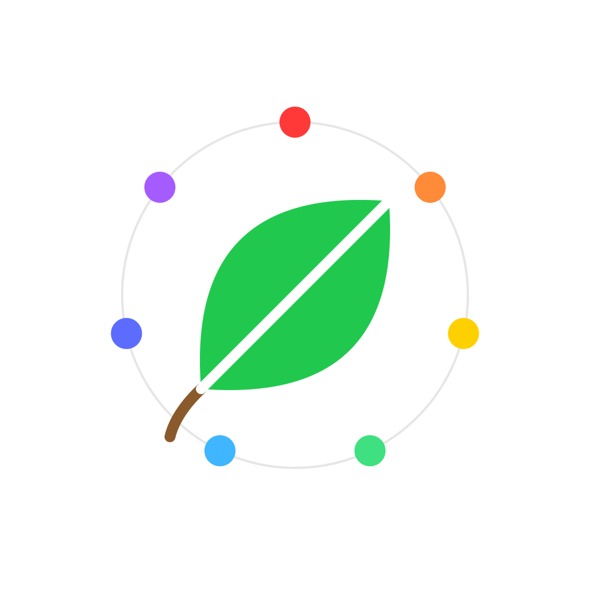

## Projects

| | Project | Description | Deployment | Repo | Stack |
|---|---|---|---|---|---|
|  | **System Atlas X** | Product brief → architecture with reasoning on every node, a review linter for gaps, and a tradeoff engine that swaps technologies. Local-first. | [Live](https://system-atlas-x.vercel.app) | [Repo](https://github.com/KayTiwari/system-atlas-x) | TypeScript · React · Next.js · React Flow · Zustand · Tailwind · Gemini API · Vercel |
|  | **Backend Omniscience** | Free 0→1 backend curriculum — HTTP, SQL, APIs, queues, system design, AWS — with ~500 in-browser graded drills and a 140-term encyclopedia. | [Live](https://backend-omniscience.vercel.app) | [Repo](https://github.com/KayTiwari/backend-omniscience) | TypeScript · React · Vite · PGlite (in-browser Postgres) · Tailwind · Vercel |
|  | **AIMxd** | Marketplace for vetted aerial farmland imagery (NDVI, multispectral, thermal, LiDAR) with Stripe Connect payouts and per-order license PDFs. | [Live](https://dfxd.vercel.app) | Private | TypeScript · Next.js · Postgres · Prisma · Stripe Connect · Cloudflare R2 · Resend |
|  | **SafeIntake** | PHI/PII redaction and document intake for regulated workflows: detect spans, review each, apply permanent redactions, append-only audit log. | [Live](https://safeintake.vercel.app) | [Repo](https://github.com/KayTiwari/safeintake) | Python · Flask · SQLAlchemy · PyMuPDF · React · Docker · GitHub Actions |
|  | **Simply Ambient** | Binaural frequency generator + breath-work companion for iOS & Android, built on a real-time audio engine. | Google Play (testing) | [Repo](https://github.com/KayTiwari/Simply-Ambient) | TypeScript · React Native · Expo · Web Audio |
|  | **Wild5** | Psychological-wellness education app for teens and college students; sold to psychologists in San Francisco and Austin. | iOS + Android | [Repo](https://github.com/KayTiwari/Wild5) | JavaScript · React Native |
|  | **Car Market Check** | Find used cars priced below market — scores each asking price against a fair-market estimate (Great / Good / Fair) and sorts best deals first. | [Live](https://car-market-check.vercel.app) | [Repo](https://github.com/KayTiwari/CarMarketCheck) | JavaScript · React 18 · Serverless functions · MarketCheck API |
|  | **SpaceFighterV** | Space-invaders clone with user authentication and scores persisted to a database. | [Live](https://spacefighterv.vercel.app) | [Repo](https://github.com/KayTiwari/SpaceFighterV) | TypeScript · React · Node.js · Express · MongoDB |
|  | **RedPlus** | Blood-bank management desktop app with user auth and collection creation, backed by a SQL database. | Desktop (Windows) | [Repo](https://github.com/KayTiwari/RedPlus) | C# · .NET Core · WPF · SQL Server |
|  | **Snake** | Classic snake game built as a Windows Forms desktop app. | Desktop (Windows) | [Repo](https://github.com/KayTiwari/Snake) | C# · .NET · Windows Forms |
